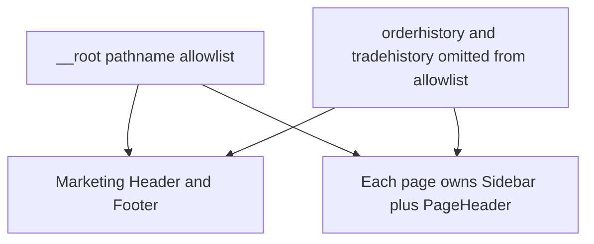

# Frontend code-mess assessment

This is an assessment of the current `frontend-web` codebase. It records what has to be fixed before this app is wired to the backend. No application code was changed to produce it.

## Verdict

The visual system was started correctly. Design tokens live in [`src/styles/token.css`](../../src/styles/token.css), shadcn is configured in [`components.json`](../../components.json), and a small kit exists under [`src/components/ui`](../../src/components/ui). The pages themselves were built as a Figma-shaped demo. The site can look right while the implementation is not product-ready.

**Significant refactoring is required** before this frontend is connected to the backend. A greenfield UI rewrite is not required. Keep the routes, the token file, and the existing shadcn primitives. Replace the demo data, the duplicated shells, and the hand-rolled widgets.

What is already in place and should stay:

- TanStack Start + file routes under [`src/routes`](../../src/routes)
- A real primitive and semantic token file
- shadcn `base-nova` config, lucide icons, and the nine primitives that were actually added
- Feature folders (`auth`, `dashboard`, `trade`, `wallet`, `energy-assets`, `landing`)

What has to change before backend work lands here:

- One color system, with the orphan `gx-*` classes and the unwired `brand-*` / `bg-*` aliases removed or defined
- One authenticated layout, instead of every page mounting its own sidebar and header
- SSR only on public pages
- shadcn components for the widgets the screens already reinvent
- A data boundary (React Query hooks later) in place of `setTimeout`, `localStorage`, and hardcoded arrays

## 1. Hardcoded colors and broken tokens

Tokens exist. [`src/styles/token.css`](../../src/styles/token.css) defines primitive scales (navy, teal, red, green, amber, blue) and semantic groups: surfaces, text, borders, actions, feedback, trade, and charts. [`src/styles/adapter.css`](../../src/styles/adapter.css) maps a subset of those onto shadcn names (`--background`, `--primary`, `--accent`, `--destructive`, and so on). [`src/styles.css`](../../src/styles.css) exposes them to Tailwind through `@theme`.

Most app UI does use token classes such as `bg-card`, `text-accent`, and `text-muted-foreground`. The mess is that three color systems are in use at once, and two of them are incomplete.

### Three parallel systems

1. **shadcn names** (`bg-primary`, `text-muted-foreground`, `bg-accent`). These are the ones the UI kit understands.
2. **Semantic aliases** (`text-text-*`, `bg-bg-*`, `brand-*`). [`src/styles.css`](../../src/styles.css) maps Tailwind colors onto CSS variables that are never defined in `token.css` or `adapter.css`:
   - `--brand-primary`, `--brand-accent`, `--brand-danger`, `--brand-warning`, `--brand-info`, `--brand-purple`, and the `*-muted` variants
   - `--bg-canvas`, `--bg-surface`, `--bg-elevated`, `--bg-overlay`, `--bg-sunken`
   - `--border-brand`, `--text-brand`, `--text-on-brand`
   Profile and a few other screens use these classes. They resolve to nothing.
3. **Orphan `gx-*` classes.** Order history and trade history are styled with a private vocabulary that has no definitions anywhere under `src/`: `bg-gx-ok-bg`, `text-gx-fg4`, `border-gx-edge`, `var(--gx-fg1)`, `var(--gx-shadow-card)`, `var(--gx-shadow-modal)`, plus a `gx-shimmer` animation. See [`src/components/history/OrderHistory.tsx`](../../src/components/history/OrderHistory.tsx) (status map around line 171, modal around line 240, table around line 473) and [`src/components/history/TradeHistory.tsx`](../../src/components/history/TradeHistory.tsx) (status map around line 210). Wallet account rows also use `text-gx-fg4` in [`src/components/wallet/BankAccountList.tsx`](../../src/components/wallet/BankAccountList.tsx).

Feedback and trade tokens are defined in `token.css` and then barely used. `--trade-buy-*` and `--trade-sell-*` have no component callers. History buy/sell pills use `gx-buy-*` / `gx-sell-*` instead. The order book uses `text-accent` and `text-destructive`.

### Hardcoded hex

Arbitrary hex is concentrated, not spread across every file. The worst files:

| File | What is hardcoded |
| --- | --- |
| [`src/components/auth/Signup.tsx`](../../src/components/auth/Signup.tsx) | Marketing panel surfaces and text: `bg-[#15253e]` (line 224), plus `#8492a6`, `#b1bccb`, `#93a0b2`, `#5f6c7f`, `#68768a` |
| [`src/components/auth/SignInForm.tsx`](../../src/components/auth/SignInForm.tsx) | Chip colors `bg-[#e8eef6]` / `text-[#4a5f78]` (line 163), node `bg-[#1a2840]` and `rgba(14,165,146,…)` shadow (line 333), plus `text-[#a8bdd4]` / `text-[#60748d]` |
| [`src/components/trade/MarketChart.tsx`](../../src/components/trade/MarketChart.tsx) | Chart library colors `#0ea592` and `#ef4444`, and grid lines as `rgba(107,122,153,…)` |
| [`src/components/page-components/Header.tsx`](../../src/components/page-components/Header.tsx) line 127 and [`src/components/profile/Profile.tsx`](../../src/components/profile/Profile.tsx) line 308 | The same avatar stack: `border-[#5eead4]/30 bg-[#0ea592] ring-[#0ea592]/10` |
| [`src/routes/__root.tsx`](../../src/routes/__root.tsx) line 71 | Selection color `rgba(79,184,178,0.24)`, which is a different teal from the accent token `#0ea592` |

Chart components also pass hex fallbacks next to CSS variables (`GenerstionChart`, `ForecastCard`, `EnergySeriesChart`, `UsageCategoryCard`).

### Same role, different color

| Role | What the pages actually use |
| --- | --- |
| Logo mark | Marketing header/footer: `bg-primary`. Auth panels: `bg-accent`. Sidebar avatar: `bg-accent`. |
| User avatar | App header and profile: hardcoded `#0ea592`. The token for that teal is `bg-accent` / `--action-accent`. |
| Filled control | `Button` default is `bg-accent` (teal). Checkbox, switch, and badge default are `bg-primary` (navy). |
| Success / online | Landing checks: `text-emerald-500` ([`HeroSection.tsx`](../../src/components/landing/HeroSection.tsx) lines 38, 46, 54). Profile online dot: `bg-emerald-400` / `text-emerald-500`. Auth beta chip: `emerald-400` / `emerald-300` ([`SignInForm.tsx`](../../src/components/auth/SignInForm.tsx) line 297). Wallet sell amount: `text-feedback-success-text`. History settled: `bg-gx-ok-*` (undefined). |
| Warning | History pending: `gx-warn-*` plus `bg-amber-400`. Wallet pending: `feedback-warning-*`. Bank micro-deposit: `text-amber-500`. Profile warning: `bg-brand-warning` (undefined variable). |
| Buy / sell | Tokens `--trade-buy-*` / `--trade-sell-*` unused. History: undefined `gx-buy-*` / `gx-sell-*`. Order book: accent vs destructive. |
| Card surface | Trade panels: `bg-card` + `border-border-subtle`. History tables: `bg-card` + `border-gx-edge` + `shadow-[var(--gx-shadow-card)]`. Profile: `bg-bg-elevated` (undefined). Auth side panel: `bg-[#15253e]`. |

Raw Tailwind palette usage is small (about a dozen `emerald-*` / `amber-*` / one `border-red-500`) compared with the token classes. It still breaks the system, because those palette steps are not the feedback tokens.

## 2. Structure

There is no `api/` layer, no feature modules, and no stores. [`src/data`](../../src/data) and [`src/hooks`](../../src/hooks) are empty directories. React Query is mounted from [`src/router.tsx`](../../src/router.tsx), and [`src/integrations/tanstack-query/root-provider.tsx`](../../src/integrations/tanstack-query/root-provider.tsx) only constructs a `QueryClient`. No screen calls `useQuery` or `useMutation`. [`src/env.ts`](../../src/env.ts) exposes optional `SERVER_URL` and `VITE_APP_TITLE`, is never imported, and has no API base URL.

Business logic, sample data, and layout sit in the same files.

### God files

| Lines | File | What it mixes |
| ---: | --- | --- |
| 897 | [`src/components/profile/Profile.tsx`](../../src/components/profile/Profile.tsx) | App shell, personal form, password demo, trading prefs, KYC/meter cards, integrations UI, `localStorage` |
| 693 | [`src/components/history/OrderHistory.tsx`](../../src/components/history/OrderHistory.tsx) | Types, sample orders, filters, pagination, cancel, modal, demo loading/error/empty |
| 673 | [`src/components/history/TradeHistory.tsx`](../../src/components/history/TradeHistory.tsx) | Same pattern for trades |
| 536 | [`src/routes/energyassets.tsx`](../../src/routes/energyassets.tsx) | Route, hardcoded asset list, KPI dashboard, filter and sort |
| 419 | [`src/components/auth/Signup.tsx`](../../src/components/auth/Signup.tsx) | Multi-step orchestration, fake async, marketing panel |
| 411 | [`src/components/auth/SignInForm.tsx`](../../src/components/auth/SignInForm.tsx) | Form plus a decorative dashboard mock |

### Duplicated chrome

Two different components are both named Header:

- [`src/components/Header.tsx`](../../src/components/Header.tsx) is the marketing bar (logo, sign in). [`src/routes/__root.tsx`](../../src/routes/__root.tsx) renders it.
- [`src/components/page-components/Header.tsx`](../../src/components/page-components/Header.tsx) is the app bar (property, meter, notifications, user).

There is no shared authenticated layout route. Dashboard, wallet, trade, profile, energy, notifications, and both history pages each mount `Sidebar` and `PageHeader` themselves.

[`src/routes/__root.tsx`](../../src/routes/__root.tsx) decides the public shell with a pathname allowlist (lines 57–63): `/dashboard`, `/profile`, `/energyassets`, `/trade`, `/wallet`, `/notification`. `/orderhistory` and `/tradehistory` are missing, so those pages render the marketing header and footer **and** the app sidebar.

### Broken navigation

[`src/components/page-components/Sidebar.tsx`](../../src/components/page-components/Sidebar.tsx) lists eight items (lines 19–28) but `ImplementedRoute` only includes `/dashboard`, `/energyassets`, `/notification`, and `/profile` (lines 32–41). Anything else is a plain `<a href>`, which full-reloads the document.

- `/trade` and `/wallet` exist as routes and are still treated as unimplemented.
- `/forecast` does not exist.
- `/history` does not exist. History is `/orderhistory` and `/tradehistory`.

### Naming

| Path | Problem |
| --- | --- |
| [`src/components/dashboard/CurentSlotCard.tsx`](../../src/components/dashboard/CurentSlotCard.tsx) | Filename missing an `r`. Export is `CurrentSlotCard`. |
| [`src/components/dashboard/GenerstionChart.tsx`](../../src/components/dashboard/GenerstionChart.tsx) | Filename missing an `a`. Export is `GenerationChart`. |
| `Notificationfeed.tsx`, `Notificationfilterbar.tsx`, `Notificationitem.tsx` | No casing convention. |
| [`src/components/landing/BenefitsHeader.tsx`](../../src/components/landing/BenefitsHeader.tsx) | Exported as `BenifitsSection`. Visible copy says "Benifits". |
| `/energyassets`, `/orderhistory`, `/tradehistory` | Route paths have no separators. |
| `/notification` | Singular path, "Notifications" in the UI. |
| [`src/components/landing/FeaturesSection.tsx`](../../src/components/landing/FeaturesSection.tsx) | Empty section with `border-red-500`. Never imported. |

## 3. Demo workflows pretending to be product

Almost every authenticated flow is local simulation. There is no `fetch` client and no API module. Persona data is copied by hand: **Sara A. / Villa 47 / JLT Zone 4 / notificationCount 3** appears on the dashboard, energy assets, notifications, wallet, both history pages, the trading terminal, and the profile.

### Auth, KYC, meter

[`src/components/auth/Signup.tsx`](../../src/components/auth/Signup.tsx) advances steps with `setTimeout` (700ms for create-account at line 70, 600ms for verify, KYC, and meter). KYC and meter status are written to `localStorage` via [`src/lib/kyc-status.ts`](../../src/lib/kyc-status.ts) and [`src/lib/smart-meter-status.ts`](../../src/lib/smart-meter-status.ts). Email verification accepts any 6 digits. Sign-in does not authenticate; [`src/components/auth/SignInForm.tsx`](../../src/components/auth/SignInForm.tsx) line 29 calls `alert(\`Welcome back, ${email}!\`)`.

### Profile

[`src/components/profile/Profile.tsx`](../../src/components/profile/Profile.tsx) line 247 checks the current password against the literal `GridX123!`. Line 475 prints `Demo current password: GridX123!` in the UI. A match sets a success message that the password "has been updated securely." Personal details and preferences persist to `localStorage` only.

### Trade

[`src/lib/market-data.ts`](../../src/lib/market-data.ts) moves the price with `Math.random`. The trading terminal polls it on an interval. [`src/components/trade/OrderBook.tsx`](../../src/components/trade/OrderBook.tsx) jitters static bids and asks and labels the panel "Live". [`src/components/trade/MarketChart.tsx`](../../src/components/trade/MarketChart.tsx) builds candles from `Math.sin` / `Math.cos`. [`src/components/trade/OrderPanel.tsx`](../../src/components/trade/OrderPanel.tsx) shows a hardcoded balance (`RM 2,847.50`) and the Buy/Sell button has no submit handler.

### Wallet, notifications, energy, history

- Wallet balance and payment methods are sample constants (`AED 284.50`, sample cards and bank accounts).
- [`src/routes/notification.tsx`](../../src/routes/notification.tsx) inlines a long list of fake notifications. The category filter state does not filter the feed.
- [`src/routes/energyassets.tsx`](../../src/routes/energyassets.tsx) keeps the asset catalog in the route module. [`src/components/energy-assets/PeakPeriodCard.tsx`](../../src/components/energy-assets/PeakPeriodCard.tsx) builds its heatmap with `Math.random`.
- History components take a `HistoryDemoState` of `'populated' | 'loading' | 'error' | 'empty'` ([`OrderHistory.tsx`](../../src/components/history/OrderHistory.tsx) line 29). The routes always pass `populated`. Cancel updates local state and calls `toast`, and no `<Toaster />` is mounted, so the toast never appears. Export and deposit/withdraw buttons have no handlers.

### Product inconsistencies that the demo baked in

- Currency: dashboard, wallet, energy, notifications, and history use **AED**. The trade terminal and market summary use **RM** ([`OrderPanel.tsx`](../../src/components/trade/OrderPanel.tsx) line 21, [`MarketSummary.tsx`](../../src/components/trade/MarketSummary.tsx)).
- [`src/routes/about.tsx`](../../src/routes/about.tsx) line 45 is titled "About this demo" and describes a temporary interface. [`src/components/Footer.tsx`](../../src/components/Footer.tsx) line 18 says "Temporary demo interface."

### Dependencies that do nothing

| Package | Status |
| --- | --- |
| `@faker-js/faker` | In `package.json`. Zero imports. |
| `zustand` | In `package.json`. No stores. |
| `@tanstack/react-form` | In `package.json`. Forms are manual `useState`. Zod is used on create-account only. |
| `@tanstack/react-table` | In `package.json`. History tables are hand-rolled `<table>` elements. |
| `@tanstack/match-sorter-utils` | Unused. |
| `@fontsource-variable/geist` | Declared. The app loads Inter. |
| `sonner` | `toast` is called from history. `<Toaster />` is never mounted. |
| `@tanstack/react-query` | Provider only. No queries. |
| Many `@tanstack/*` entries | Pinned to `"latest"`. |

## 4. Fonts and color consistency across pages

Inter is the only typeface that is loaded, in [`src/routes/__root.tsx`](../../src/routes/__root.tsx) (weights 400, 500, 600, 700). [`src/styles.css`](../../src/styles.css) sets `--font-sans` and `--font-heading` to Inter. Geist is a dependency and is never imported.

Typography is three systems at once:

- Design utilities in [`src/styles.css`](../../src/styles.css) lines 162–242: `text-display-*`, `text-heading-*`, `text-label-*`, `text-caption`, `text-code`. Used on landing, dashboard cards, wallet, and energy.
- The default Tailwind scale (`text-xs` through `text-4xl`) everywhere else.
- Arbitrary sizes (`text-[10px]`, `text-[11px]`, `text-[26px]`, `text-[9px]`) on auth, history pills, and the order book.

Auth page titles use `font-heading text-[26px] font-bold`. App pages use `text-heading-2`. Profile uses `font-heading text-2xl sm:text-3xl`. Wallet section titles use `text-sm font-bold`. `font-mono` is the system mono stack from `.text-code`, not a loaded brand mono. `MarketChart` also hardcodes `fontFamily: 'Inter, sans-serif'`.

Color consistency is the same problem as section 1, visible page to page: a navy logo on the marketing site, a teal logo on auth, emerald for "success" on the landing page, feedback tokens on the wallet, and undefined `gx-*` pills on history.

## 5. UI/UX

These are defects visible from the code, not a visual redesign list.

**Shell**

- History pages get both the marketing header/footer and the app sidebar, because they are missing from the allowlist in [`src/routes/__root.tsx`](../../src/routes/__root.tsx).
- Sign-in and sign-up are `fixed inset-0` overlays sitting under the public header and footer.
- The public header links home and sign-in only. About and sign-up are absent.
- Sidebar links to `/forecast` and `/history` 404. Trade and wallet full-reload.
- The sidebar is a permanent `h-screen` column (`w-55` / `w-19`) with no mobile sheet.
- [`src/routes/wallet.tsx`](../../src/routes/wallet.tsx) lays transactions and payment methods out as `flex flex-row` with no breakpoint that stacks them.

**Dead controls**

- Hero "See How It Works" is a `Button` with no `href` and no handler ([`HeroSection.tsx`](../../src/components/landing/HeroSection.tsx)).
- CTA "Start trading Energy" and "Request demo" do not navigate ([`CTASection.tsx`](../../src/components/landing/CTASection.tsx)).
- FAQ rows show chevrons and do not expand ([`FAQSection.tsx`](../../src/components/landing/FAQSection.tsx)).
- Forgot password is a button with no action ([`SignInForm.tsx`](../../src/components/auth/SignInForm.tsx)).
- Order panel submit, deposit, withdraw, and CSV export do nothing.

**Accessibility**

- History "modals" are a fixed `div` with a click-away backdrop. They have no `role="dialog"`, no focus trap, and no Escape handling ([`OrderHistory.tsx`](../../src/components/history/OrderHistory.tsx) around line 235, [`TradeHistory.tsx`](../../src/components/history/TradeHistory.tsx) around line 259).
- Close, trash, and the collapsed sidebar toggle are icon-only buttons without an accessible name.
- Hero muted copy uses `text-muted-foreground/70`, which stacks opacity on an already muted color.

**Copy that tells the user this is a prototype**

Footer, about page, and the profile password hint all say the interface is a demo. That has to come out before this is a product surface, and the flows behind those strings have to become real.

## 6. SSR policy

TanStack Start server-renders every route. [`src/routeTree.gen.ts`](../../src/routeTree.gen.ts) registers the app with `ssr: true` (line 300). No route file sets `ssr: false`. No route defines a `loader` or `beforeLoad`.

Intended split:

| Route | SSR |
| --- | --- |
| `/` home | Keep on |
| `/about` | Keep on |
| `/sign-in`, `/sign-up` | Keep on. These are public pages. |
| `/dashboard` | Off |
| `/energyassets` | Off |
| `/trade` | Off |
| `/wallet` | Off |
| `/profile` | Off |
| `/notification` | Off |
| `/orderhistory` | Off |
| `/tradehistory` | Off |

Any future marketing page stays on. Any future authenticated page is `ssr: false`. The fix is a route option on each authenticated file (or one authenticated layout route that opts out), not a global change that would also disable the home page.

## 7. Hand-rolled components instead of shadcn

[`components.json`](../../components.json) is set to style `base-nova`, CSS variables, lucide, and the `#/components/ui` alias. The kit that was actually downloaded is nine files:

`badge`, `button`, `card`, `checkbox`, `input`, `label`, `select`, `switch`, `tabs`.

Usage is uneven:

| Primitive | Where it is used |
| --- | --- |
| `button`, `card`, `badge` | Many feature files. Plenty of raw `<button>` and `div` cards remain beside them. |
| `input` | Auth, profile, parts of wallet. Trade, history, and the OTP inputs are raw `<input>`. |
| `label`, `select`, `switch` | Essentially only [`Profile.tsx`](../../src/components/profile/Profile.tsx). KYC, energy filters, wallet, and history use native `<select>`. |
| `checkbox` | Sign-in and create-account only. |
| `tabs` | **Never imported.** Feature code builds its own tab strips on energy assets, payment methods, the order panel, and the trading terminal. [`src/components/ui/tabs.tsx`](../../src/components/ui/tabs.tsx) line 4 imports `cn` from the npm package `"cn"` instead of `#/lib/utils`. |

[`src/components/energy-assets/AssetCard.tsx`](../../src/components/energy-assets/AssetCard.tsx) line 6 imports `Button` from `@base-ui/react/button` directly, skipping the shadcn wrapper in [`src/components/ui/button.tsx`](../../src/components/ui/button.tsx).

Places that rebuild a primitive the kit is meant to provide:

- Raw `<button>` in the sidebar, order panel, payment-method tabs, card/bank lists, energy tabs, and both history toolbars.
- Raw `<input>` in the order panel, both history filters, the email OTP, and the KYC file input.
- Raw `<select>` in KYC country, the energy filter bar, transaction history, and both history filters.
- Raw `<table>` in both history components. `@tanstack/react-table` is installed and unused.
- Custom overlays in both history components where a Dialog belongs.
- Custom tab rows where `ui/tabs` already exists and is unused.

## 8. shadcn components that were never added

The UI already needs these. They should be added with the shadcn CLI against the existing `components.json`, then the hand-rolled versions replaced. They should not be written again by hand.

| Add | Why it is already needed |
| --- | --- |
| `dialog` | History detail overlays |
| `dropdown-menu` | Row actions, user menu, "more" buttons that currently do nothing |
| `table` | Order and trade history |
| `sonner` | `toast()` is already called; mount `<Toaster />` in the root document |
| `skeleton` | History has a custom shimmer with a `TODO: Need to check` comment, driven by undefined `--gx-sk-*` variables |
| `sheet` | Mobile navigation. The sidebar cannot stay a permanent column. |
| `tooltip` | Icon-only actions (trash, collapse, chart controls) |
| `avatar` | Header and profile initials are duplicated hardcoded spans |
| `alert` | Profile and auth feedback are ad-hoc colored text |
| `separator` | Section dividers are one-off borders |
| `form` | `@tanstack/react-form` is installed and unused; create-account is the only Zod form |
| `tabs` | Re-add or replace the unused file so energy, wallet, and trade stop inventing tab lists |

Secondary, once the list above is in: `scroll-area`, `popover`, `breadcrumb`.

`tabs.tsx` should be replaced if the installed file does not match the current registry build. Leaving an unused primitive that imports `cn` from the wrong package is worse than not having the file.

## Recommended fix order

Do these before treating the frontend as ready for backend integration. The order is the one that removes the most risk per change. Step-by-step phases, dependencies, and done checks are in [rollout.md](./rollout.md).

1. **Token hygiene.** Define or delete the unwired `--brand-*`, `--bg-*`, `--text-brand`, and `--border-brand` aliases in [`src/styles.css`](../../src/styles.css). Delete the `gx-*` vocabulary in history and wallet and restyle those screens with the existing feedback, trade, and surface tokens. Stop adding hex and raw palette classes (`emerald-*`, `amber-*`). Point chart libraries at the CSS variables.
2. **One app shell.** Add an authenticated layout route that owns `Sidebar` and `PageHeader`. Remove the pathname allowlist in [`src/routes/__root.tsx`](../../src/routes/__root.tsx). Point the sidebar at real routes (`/trade`, `/wallet`, `/orderhistory` or a single history route). Remove `/forecast` until that page exists.
3. **SSR.** Set `ssr: false` on the authenticated routes listed in section 6. Leave `/`, `/about`, `/sign-in`, and `/sign-up` on.
4. **shadcn.** Add the components in section 8 with the CLI. Replace raw buttons, inputs, selects, tabs, tables, and overlays. Mount `<Toaster />`. Stop importing `@base-ui/react/button` from feature code.
5. **Data boundary.** Split the god files so sample arrays live in one module per feature, and screens read them through hooks. That module is what becomes React Query when the backend is ready. Do not keep `setTimeout` and `localStorage` as the integration path. Pick one currency (AED or RM) and one market locale.
6. **Typography.** Use the scale in [`src/styles.css`](../../src/styles.css) (`text-heading-*`, `text-label-*`, `text-caption`). Remove arbitrary `text-[Npx]` as screens are touched. Keep Inter. Drop `@fontsource-variable/geist` unless the design system actually calls for Geist.

Rename the typo files (`CurentSlotCard`, `GenerstionChart`, `Notificationfeed`, `Benifits`) in the same passes that touch those screens. Route renames (`/energy-assets`, `/order-history`) need redirects; do them with the shell work so links and SSR flags move together.

## Out of scope of this note

This document does not change application code, upgrade dependencies, or define the backend API contract. It only records that the data layer is missing and that the current demo flows must not be the thing the backend is bolted onto.
